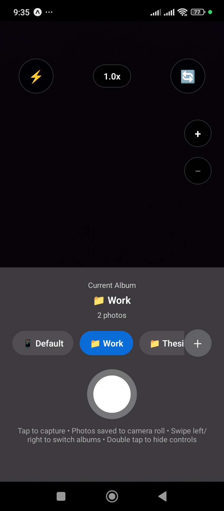

# AlbumCam 📸

A streamlined camera application for instant photo album organization.



## Features

- 📸 Take photos and organize them into albums instantly
- ↔️ Swipe left/right to switch between albums while shooting
- 🔍 Improved zoom functionality that works smoothly on all devices
- 📱 Full camera controls (flash, zoom, front/back camera)
- 💾 Persistent album settings

## Quick Start

```bash
bun install
bun expo start
```

## Documentation

All documentation has been moved to the [`docs/`](./docs) directory:

- [Changelog](./CHANGELOG.md) - Version history and release notes
- [F-Droid README](./docs/README-FDROID.md) - F-Droid specific documentation
- [F-Droid Submission](./docs/FDROID-SUBMISSION.md) - Submission guidelines
- [License](./docs/LICENSE) - MIT License

## Project Structure

```
├── app/          # Expo Router app screens
├── src/          # Source code
│   ├── screens/  # UI screens
│   ├── utils/    # Utility services
│   ├── types/    # TypeScript types
│   └── constants/# App constants
├── scripts/      # Build and validation scripts
├── config/       # Configuration files
├── docs/         # Documentation
└── metadata/     # F-Droid metadata
```

## Development

- **Start dev server**: `bun expo start`
- **Build Android**: `bun run android`
- **Build for F-Droid**: `./scripts/build-fdroid.sh`
- **Validate F-Droid**: `./scripts/validate-fdroid.sh`

## License

MIT - See [docs/LICENSE](./docs/LICENSE)
